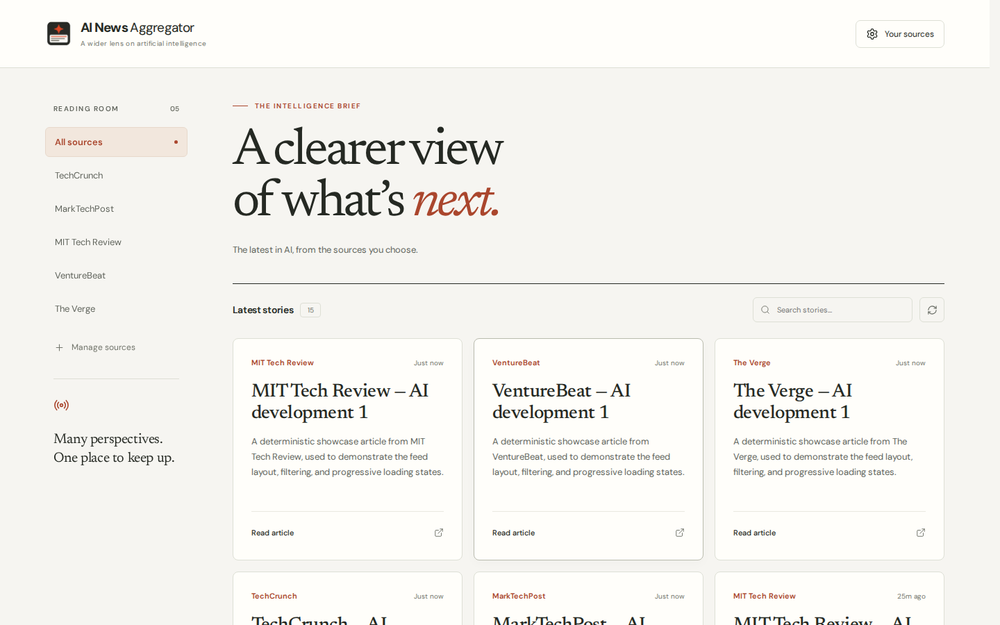
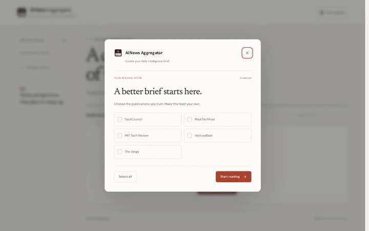

<p align="center">
  
</p>

<h1 align="center">AI News Aggregator</h1>

<p align="center">
  A focused, editorial reading room for artificial intelligence news from curated publications.
</p>

<p align="center">
  <a href="https://ainews.leonemarcos.com">
    
  </a>
  <a href="https://github.com/LeoneMarcos/AI-News-Aggregator/actions/workflows/ci.yml">
    
  </a>
  <a href="LICENSE">
    
  </a>
</p>

<p align="center">
  
  
  
  
  
</p>

<p align="center">
  <a href="#overview">Overview</a> ·
  <a href="#showcase">Showcase</a> ·
  <a href="#features">Features</a> ·
  <a href="#architecture">Architecture</a> ·
  <a href="#tech-stack">Tech Stack</a> ·
  <a href="#rss--cors-proxy-limits">RSS & CORS Limits</a> ·
  <a href="#quick-start">Quick Start</a>
</p>

---

<p align="center">
  
</p>

## Overview

**AI News Aggregator** is a lightweight, client-side editorial reader built with React 19, TypeScript, and Vite. It collects and normalizes articles from leading artificial intelligence RSS feeds into a clean, distraction-free intelligence brief.

The application operates without tracking, server infrastructure, or account requirements. Reader preferences and short-lived feed caches are saved locally in the browser.

### Highlights

- **Curated reading room** — Choose which AI publications to include in your daily brief.
- **Editorial design** — Warm cream, charcoal, and terracotta palette with Newsreader serif typography.
- **Instant story search** — Filter headlines, summaries, and publication names on the fly.
- **Source navigation** — Seamlessly filter by individual publication or view the aggregated brief.
- **Accessible & responsive** — Semantic HTML, accessible ARIA labels, focus containment, and mobile navigation.
- **100% static delivery** — Runs entirely in the client with no proprietary backend.

---

## Showcase

Watch the short product walkthrough demonstrating source selection, progressive loading, live feed filtering, and keyword search:

[](https://raw.githubusercontent.com/LeoneMarcos/AI-News-Aggregator/main/showcase-assets/ai-news-aggregator-showcase.mp4)

The animated preview shows a short excerpt of the canonical showcase. Open the full video below for the complete flow.

[](https://raw.githubusercontent.com/LeoneMarcos/AI-News-Aggregator/main/showcase-assets/ai-news-aggregator-showcase.mp4)

---

## Features

- **Multi-source RSS normalization** — Unifies RSS 2.0 and Atom feeds into consistent article entities.
- **Source selection modal** — Accessible dialog with keyboard trapping (`Escape` / `Tab`), select/deselect all, and local persistence.
- **Responsive toolbar** — Search field with instant clear button, live article counter, and animated refresh button.
- **Progressive feed delivery** — Shows skeleton placeholders and updates feed content as each source completes.
- **Mobile optimization** — Smooth horizontally scrollable filter bar with minimum 44px touch targets.
- **Resilient error handling** — Preserves sources that load successfully if other feeds fail, and displays a retry action when all sources fail; does not attempt to diagnose underlying external network outage causes.

Supported publications:
- **TechCrunch** (Artificial Intelligence)
- **MarkTechPost**
- **MIT Technology Review** (AI Topic)
- **VentureBeat** (AI Channel)
- **The Verge** (AI Feed)

---

## Architecture

AI News Aggregator is structured as a static client-side single-page application:

```text
Browser
  ├── Setup Modal ───────> localStorage preferences
  ├── Feed Pipeline ─────> CORS proxy race (Promise.any) ──> DOMParser RSS/Atom ──> Normalized Articles
  └── Presentation ──────> Reading room sidebar, toolbar, responsive grid, accessible article cards
```

- `src/App.tsx` — Main application shell, state orchestration, keyboard management, and feed layout.
- `src/feed.ts` — Feed fetching pipeline, proxy fallbacks, XML/JSON parsing, TTL cache, and progress reporting.
- `src/setup.ts` — Preference storage, schema validation, and legacy key migrations.
- `src/utils.ts` — Text helpers, HTML entity decoding, HTML tag stripping, and relative timestamp calculations.
- `src/style.css` — Editorial design system with semantic CSS tokens and responsive breakpoints.

---

## Tech Stack

| Area | Technologies |
| --- | --- |
| Frontend | React 19, TypeScript |
| UI | Lucide React, Google Fonts |
| Data | RSS feeds, client-side XML parsing, CORS proxy fallbacks |
| Build | Vite 7 |
| Testing | Vitest 4, jsdom |
| CI | GitHub Actions |
| Hosting | Cloudflare Pages |

---

## RSS & CORS Proxy Limits

Because third-party RSS endpoints do not emit `Access-Control-Allow-Origin` headers for arbitrary browser origins, this client-side application relies on public CORS proxy strategies:

1. **Proxy Racing (`Promise.any`)**:
   Each source request races multiple public CORS gateways (`corsproxy.io`, `allorigins.win`, and `rss2json.com`) with a strict 5-second `AbortController` timeout. The first successful response resolves the feed, and losing requests are immediately aborted.
2. **Partial Availability**:
   If an external feed endpoint or proxy experiences rate limits or downtime, successful sources still render immediately. Total feed failure only occurs if all proxies fail for all selected sources, presenting a retry action; the client does not diagnose underlying network causes.
3. **Local TTL Cache**:
   To minimize external network calls and proxy rate limits, fetched feeds are cached in browser `localStorage` for 15 minutes. A manual refresh bypasses the cache.
4. **Content Sanitization**:
   External XML and HTML descriptions are stripped of all executable markup and scripts before text rendering, preventing cross-site scripting (XSS).

---

## Quick Start

### Prerequisites

- Node.js 22 (recommended) and npm (use `npm ci` to respect `package-lock.json`)
- Optional for showcase capture: Google Chrome / Playwright browser, FFmpeg, and an active local preview/dev server

### 1. Clone the repository

```bash
git clone https://github.com/LeoneMarcos/AI-News-Aggregator.git
cd AI-News-Aggregator
```

### 2. Install dependencies

```bash
npm ci
```

### 3. Start development server

```bash
npm run dev
```

Open the localhost URL printed by Vite in your browser.

---

## Verification & Commands

| Command | Description |
| --- | --- |
| `npm run dev` | Starts local Vite dev server |
| `npm run build` | Builds optimized static production bundle to `dist/` |
| `npm run preview` | Previews production build locally |
| `npm test -- --run` | Executes complete Vitest unit and component test suite |
| `npm run typecheck` | Validates strict TypeScript compilation without emit |

The Vitest suite covers feed parsing, proxy fallback behavior, cache handling, utility functions, preference migration, and the typed application modules. The **Publish Showcase** GitHub Actions workflow records a deterministic browser walkthrough with mocked RSS responses and regenerates the canonical video, poster, and short README GIF preview when relevant product/showcase inputs change; it can also be run manually. The stable media paths are reused across the project presentation.

---

## Documentation

- [`ARCHITECTURE.md`](ARCHITECTURE.md) — Architecture and module flow.
- [`DESIGN.md`](DESIGN.md) — Visual design tokens, layout hierarchy, and accessibility rules.
- [`PRODUCT.md`](PRODUCT.md) — Functional requirements and acceptance criteria.
- [`STACK.md`](STACK.md) — Technology stack constraints and rules.
- [`TEST_PLAN.md`](TEST_PLAN.md) — Verification strategy and automated test coverage.
- [`docs/STATUS.md`](docs/STATUS.md) — Status log and release evidence.

---

## License

This project is licensed under the **Apache License 2.0**. See [`LICENSE`](LICENSE) for details.
